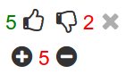

# Neutral

Neutral is a rails engine providing ajaxful positive/negative voting solution for your ActiveRecord objects along with couple of additional features.

## Installation

Add following into your Gemfile

    gem 'neutral'

Run

    $ bundle
 
Or install it yourself as

    $ gem install neutral

### Generation

Generate required files using

    $ rails g neutral:install

And proceed to migrate newly created migration files

    $ rake db:migrate

## Usage

Make your ActiveRecord model voteable

    class Post < ActiveRecord::Base
      neutral
    end

And select your voter model

    class User < ActiveRecord::Base
      neutral_voter
    end

*Note: If your voter model is not User configure this setting inside neutral.rb [intializer](https://github.com/petertoth/neutral#configuring-neutral)*

To display voting use `voting_for` helper in your view : 

    <%= voting_for post %>

## Customization

### View

You can also pass two additional options to `voting_for` helper

* **[icons](https://github.com/petertoth/neutral#font-awesome)** : Icons used for positive/negative/remove
* **difference** : Display difference count instead of positive/negative counts
 *If the difference is positive i.e positive votes - negative votes > 0 then the color of the span is green, red otherwise*

Example : 

    <%= voting_for article, icons: :myfabulousicons, difference: true %>

### Configuring Neutral

In *config/initializers/neutral.rb* you can configure these options :

* **can_change** : Determine wheter a voter can change(update,delete) his vote
* **current_voter_method** : This is most typically `current_user` but if not, change this to your own representation of a voter instance e.g `current_client` or `current_customer`. Also make sure it accessible from your ApplicationController.
* **require_login** : Voter is/is not required to be authenticated in order to vote. Setting to false is not recommended
* **vote_owner_class** : Configure an owner of a vote. Pass string of class name of the model you added `neutral_voter` into. For example `'User'`, `'Client'` or `'Customer'`
* **default_icon_set** : This icon set is used when no explicit icon set is passed to `voting_for` helper

### Font Awesome

This engine enables you to define your own icon sets using FontAwesome icons that provide representation of voting related actions such as like, dislike, remove, plus, minus, whatever ...

You can use any [FontAwesome icon class](http://fontawesome.io/icons/) available

Define an icon set in your *neutral.rb* initializer

    #config/initializers/neutral.rb

    Neutral.define do
      set :myicons do
        positive "fa-thumbs-up"
        negative "fa-thumbs-down"
        remove "fa-times"
      end
      
      set :fabulous do
        positive "fa-plus"
        # If any of action is omitted, definition from your default icon set is used.
        # In this case "fa-thumbs-down-o" would be used for negative and "fa-times" 
        # for remove action because because :thumbs(default set) contains these definitions.
      end
    end

Finally use it as follows :

    <%= voting_for voteable, icons: :myicons %>

If you ever need to access a definition of a given icon set proceed analogically as follows : `Neutral.icons.thumbs.positive`

## i18n

Define your custom error messages for each of your locale in *config/locales/neutral.yml*

    en:
      errors:
        duplication: "You have already selected this option!"
        cannot_change: "You are not permitted to change the vote!"
        require_login : "You must be logged in to vote!"

## Uninstallation

Run : 

    $ rails g neutral:uninstall

It :

* comments `neutral` in your *routes.rb*

* removes `require neutral` from your stylesheet manifest

* removes *neutral.rb* initializer
* removes *neutral.yml* locale file
* removes database entities(engine's tables) and migration files - **optional**

## Contributing

1. Fork it
2. Create your feature branch (`git checkout -b my-new-feature`)
3. Commit your changes (`git commit -am 'Add some feature'`)
4. Push to the branch (`git push origin my-new-feature`)
5. Create new Pull Request

## License
MIT License. Copyright (c) 2014
